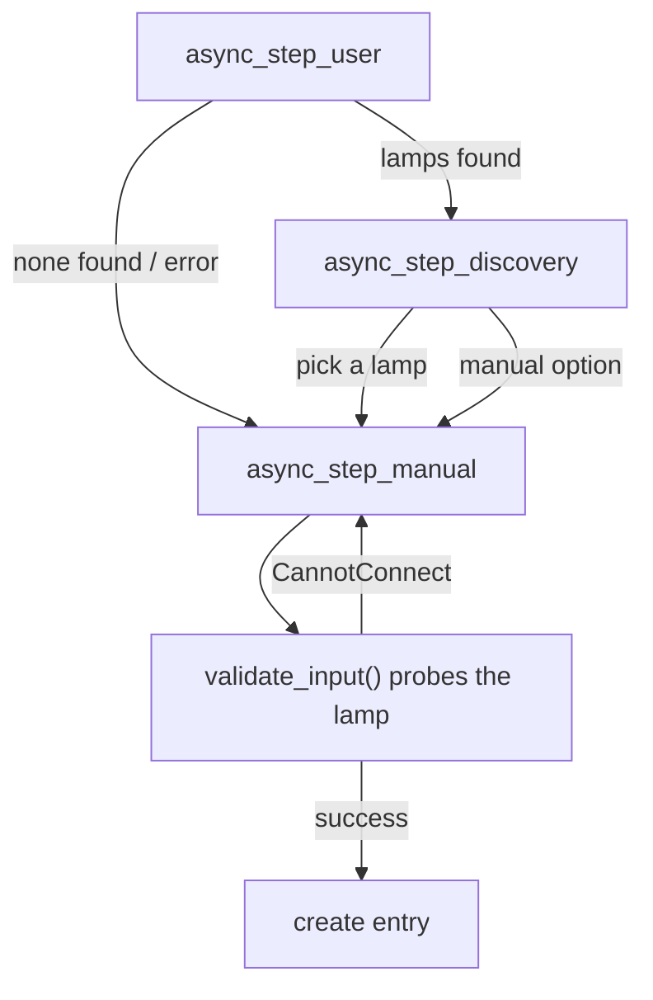
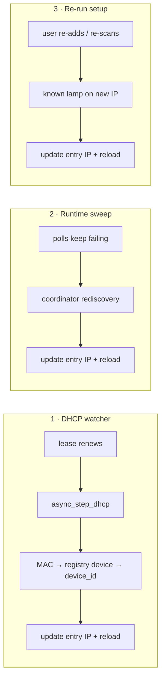

# Config Flow & IP Self-Healing

`config_flow.py` drives setup entirely through the UI — there is **no YAML**. An **options flow** lets users choose the poll interval (15 s / 30 s / 60 s); changing the setting reloads the entry so the coordinator picks up the new interval immediately. The file also carries the logic that keeps each entry pointed at the right IP after DHCP changes the lamp's address.

## Flow map



| Step | Purpose |
|---|---|
| `async_step_user` | Entry point. Runs a ~2 s UDP discovery sweep, splits results into known/unknown, and routes to the pick-list or the manual form. |
| `async_step_discovery` | Shows discovered lamps as `<model> (<ip>)`; the selection pre-fills the manual step. |
| `async_step_manual` | Validates typed or pre-filled details and creates the entry. |
| `async_step_reconfigure` | Lets the user edit an existing lamp's details (typically a changed IP). |
| `async_step_dhcp` | Self-heals a known lamp's IP when its DHCP lease renews. |

## Identity & uniqueness

Every entry's unique ID is **`dlight_<device_id>`** — one entry per physical lamp. The manual step sets it and calls `_abort_if_unique_id_configured`, so re-adding a known lamp aborts *but heals its stored IP as a side effect*:

```python
await self.async_set_unique_id(f"dlight_{user_input[CONF_DEVICE_ID]}")
self._abort_if_unique_id_configured(
    updates={CONF_IP_ADDRESS: user_input[CONF_IP_ADDRESS]}
)
```

## Validation

`validate_input` probes the lamp **once** to prove the IP/device-ID pair works, and returns a title (chosen name → reported model → raw device id). The form has a single error slot, so **every** failure funnels into `CannotConnect` — chained with `from` so the log still shows the real cause:

```python
try:
    info = await asyncio.wait_for(
        client.query_device_info(ip_address, device_id),
        timeout=VALIDATION_TIMEOUT,  # 5s, belt-and-braces over the client's own timeout
    )
except (TimeoutError, DLightError) as err:
    raise CannotConnect(...) from err
```

## The three self-healing paths

DHCP reassigns addresses; the integration recovers without a delete-and-re-add through three independent routes.



### 1 · DHCP watcher (`async_step_dhcp`)

The manifest registers `dhcp: [{"registered_devices": true}]`, so this fires **only** for MAC addresses already in the device registry. DHCP traffic carries no dLight device ID, so the chain is **MAC → registry device → our `(DOMAIN, device_id)` identifier**; the standard unique-id machinery then updates the entry's IP and reloads before aborting.

```python
mac = dr.format_mac(discovery_info.macaddress)
device = dr.async_get(self.hass).async_get_device(
    connections={(dr.CONNECTION_NETWORK_MAC, mac)}
)
# …resolve device_id, set unique_id, _abort_if_unique_id_configured(updates={ip})
```

This is why the light entity attaches the lamp's **MAC** to the device registry (`CONNECTION_NETWORK_MAC`) — it's the join key for DHCP self-healing.

### 2 · Runtime rediscovery sweep

Handled by the coordinator, not the flow — it covers setups where Home Assistant can't see the DHCP lease at all. Detailed in [Coordinator & Polling](coordinator.md#runtime-ip-rediscovery).

### 3 · Re-running setup (`async_step_user`)

A user-initiated scan splits discoveries into known and unknown. Unknown lamps go to the pick-list; a **known** lamp found on a new address has its entry updated and reloaded silently:

```python
known = {entry.unique_id: entry for entry in self._async_current_entries()}
for found in devices:
    entry = known.get(f"dlight_{found['deviceId']}")
    if entry and entry.data.get(CONF_IP_ADDRESS) != found["ip_address"]:
        self.hass.config_entries.async_update_entry(entry, data={..., CONF_IP_ADDRESS: found["ip_address"]})
        self.hass.config_entries.async_schedule_reload(entry.entry_id)
```

## Reconfigure guards against the wrong lamp

`async_step_reconfigure` must keep pointing at the **same physical lamp**. It sets the unique ID from the submitted device ID and calls `_abort_if_unique_id_mismatch()` — a different device ID means the user wants a *new* entry, not a reconfigure. On success it uses `async_update_reload_and_abort` to persist and restart against the new details.

## A note on imports

`DhcpServiceInfo` is imported **only under `TYPE_CHECKING`**. Pulling the `dhcp` component in at runtime would drag its requirements (`aiodhcpwatcher`, etc.) into environments that never use DHCP discovery — including the test suite.
