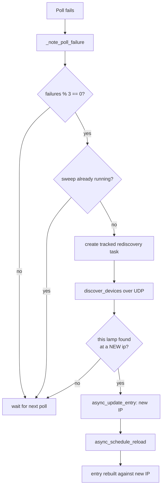

# Coordinator & Polling

`DLightCoordinator` (in `coordinator.py`) is the single owner of all communication with one lamp. It subclasses Home Assistant's `DataUpdateCoordinator` and is created by `__init__.async_setup_entry`, then published to platforms via `entry.runtime_data`.

## Responsibilities

- Fetch the lamp's **static info once**, before the first poll.
- **Poll device state** on a fixed interval.
- Own the **`command_lock`** that serializes commands across platforms.
- Drive **runtime IP rediscovery** when a lamp goes unreachable.

## Two payloads, two cadences

| Payload | Method | Cadence | Used for |
|---|---|---|---|
| Static info | `get_info()` | **Once**, in `_async_setup` | Device-registry card: model, firmware, hardware, MAC. |
| Dynamic state | `get_state(force_update=True)` | Every `POLL_INTERVAL` | The light's on/brightness/color. |

`_async_setup` tolerates failure: the info payload is cosmetic, so a lamp that can't answer `get_info` still controls fine — it just shows a generic registry card.

## The poll

```python title="coordinator.py — the core poll (abridged)"
async def _async_update_data(self) -> dict[str, Any]:
    try:
        async with asyncio.timeout(POLL_TIMEOUT):
            state = await self.device.get_state(force_update=True)
    except TimeoutError as err:
        self._note_poll_failure()
        raise UpdateFailed(...) from err
    except DLightError as err:
        self._note_poll_failure()
        raise UpdateFailed(...) from err
    self._consecutive_failures = 0
    return state
```

Key points:

- **`force_update=True` is essential.** Since `dlight-client` 1.5.0, command methods write the client's local cache **optimistically** (before the lamp confirms). A plain `get_state()` would echo our own guesses back instead of polling — and a dead lamp would never raise. Forcing the update bypasses that cache and hits the wire.
- **`POLL_TIMEOUT` (10 s)** caps a single poll.
- **Any failure → `UpdateFailed`**, which `DataUpdateCoordinator` turns into entity **unavailability**.

### Constants (`const.py`)

| Constant | Value | Meaning |
|---|---|---|
| `POLL_INTERVAL` | `30` s | How often each lamp is polled. |
| `POLL_TIMEOUT` | `10` s | Hard ceiling for a single poll. |
| `REDISCOVERY_FAILURE_THRESHOLD` | `3` | Consecutive failures between rediscovery sweeps. |
| `REDISCOVERY_DURATION` | `2.0` s | How long a sweep listens for UDP answers. |

## The command lock

```python
self.command_lock = asyncio.Lock()
```

The lamp speaks over **one TCP socket**, so commands must be serialized. `PARALLEL_UPDATES = 1` only serializes service calls *within* a single platform — it can't stop the light entity, a transition fade step, and the identify button from overlapping. `command_lock` does, by wrapping every device command across all platforms.

## Runtime IP rediscovery

When polls keep failing, the coordinator tries to find the lamp at a new address — complementing the DHCP watcher (which can't see every lease).



Details that matter:

- **Modulo, not equality** (`failures % THRESHOLD`): a lamp that changes IP *while already offline* would be missed by a single one-shot sweep, so the coordinator keeps retrying every Nth failure for as long as it stays unreachable.
- **At most one sweep in flight** — guarded by `self._rediscovery_task`.
- **Tracked task, not fire-and-forget** — `hass.async_create_task` (not a background task) so Home Assistant waits for it on shutdown instead of abandoning a half-done entry update.
- **Best-effort** — the sweep swallows all exceptions; it must never crash a poll cycle.
- On success it calls `async_update_entry` (new IP) then `async_schedule_reload`, which rebuilds the device handle against the new address.

See also the config-flow self-healing paths in [Config Flow & IP Self-Healing](config-flow.md).
