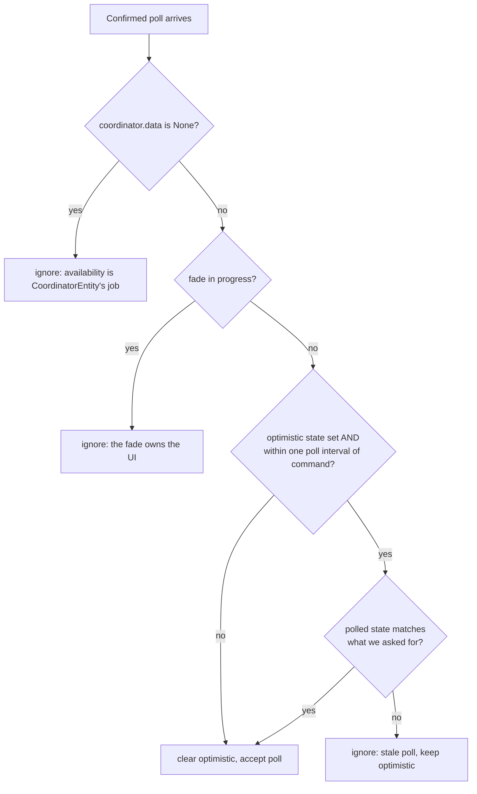

# Light Entity & Optimistic State

`DLightEntity` (in `light.py`) is a thin **read-only view** over the coordinator's cache — with one twist: **optimistic state**. The heavy lifting (device handle, polling) lives in `__init__.py` and `coordinator.py`; this module only defines the entity.

## Entity shape

```python
_attr_has_entity_name = True   # the entity IS the device's main feature…
_attr_name = None              # …so it has no name suffix
_attr_supported_color_modes = {ColorMode.COLOR_TEMP}
_attr_color_mode = ColorMode.COLOR_TEMP
_attr_min_color_temp_kelvin = KELVIN_MIN   # 2600
_attr_max_color_temp_kelvin = KELVIN_MAX   # 6000
_attr_supported_features = LightEntityFeature.TRANSITION
PARALLEL_UPDATES = 1           # serialize service calls per lamp
```

The device-registry card (manufacturer, model, firmware, MAC, configuration URL) is built **once** from `coordinator.info`, which is static.

## Brightness scaling

dLight uses **0–100 %**; Home Assistant uses **0–255**. Conversion uses a **ceiling**, deliberately:

- `50 %` → `128` (not 127).
- Any non-zero device brightness stays non-zero in HA (`1 %` → `3`, never `0` = "off").
- Only an explicit `0` lands on `0`.

```python
def _to_ha_brightness(percent: int) -> int:
    return math.ceil(percent / 100 * 255)

def _to_dlight_brightness(brightness: int) -> int:
    return max(0, min(100, math.ceil(brightness / 255 * 100)))
```

When fades need the *current* brightness as a starting point, the entity reads the device-native percent from the coordinator rather than round-tripping `0–100 → 0–255 → 0–100`, which would skew the scale (`50 → 128 → 51`).

## Optimistic state

Every readable property follows one rule: **if we recently sent a command, report what we asked for; otherwise report what the coordinator last confirmed.**

```python
@property
def is_on(self) -> bool | None:
    if self._optimistic_on is not None:
        return self._optimistic_on
    return (self.coordinator.data or {}).get("on")
```

There are three overrides — `_optimistic_on`, `_optimistic_brightness` (HA scale), `_optimistic_kelvin`. `None` means "no pending guess, trust the coordinator." A command sets them; a confirmed poll clears them.

### Why

The lamp has no single "apply this state" command and confirms slowly. Without optimism the UI would lag up to a full poll interval after every tap. With it, the UI reacts immediately and the next poll reconciles.

## Sending commands

`async_turn_on` issues the needed commands **concurrently** (the lamp has no atomic "set everything" call), then predicts the result:

```python
async with self.coordinator.command_lock:
    results = await asyncio.gather(*commands, return_exceptions=True)
for result in results:
    if isinstance(result, Exception):
        raise result
```

- `return_exceptions=True` lets every command finish before judging the batch — a plain `gather` would abandon in-flight siblings on the first failure.
- The `command_lock` keeps the batch from interleaving with fade steps or the identify flash.
- Setting brightness/temperature implicitly powers the lamp on, so an explicit `turn_on()` is only prepended for a bare turn-on or when the lamp is (as far as we know) off.
- A failure clears the optimistic guess and raises `HomeAssistantError` (translatable) — **not** `ServiceValidationError`: the user's input was valid; the *device* failed.

`light.turn_on` with brightness 0 is treated as **off**, per Home Assistant convention.

## The rapid-fire guard

The subtle part is reconciliation. A poll that was already in flight when you issued a command can carry **stale** data — applying it would snap the UI back. `_handle_coordinator_update` guards against this:



In words:

1. **Failed poll** (`data is None`) → ignored here; `CoordinatorEntity` handles availability.
2. **Mid-fade** → ignored; the fade owns the UI and requests its own refresh on completion.
3. **Within one poll interval of a command:**
   - poll **matches** the optimistic expectation → the lamp confirmed; clear the guess **immediately** for instant confirmation.
   - poll **mismatches** → it's stale; ignore it so the UI doesn't snap back during rapid-fire interactions.
4. **Otherwise** → accept the poll and clear the guess.

This is what stops a quick brightness-slider drag from flickering back to an old value mid-gesture.

## Emulated transitions

The protocol has no native fade, so `transition:` is emulated by a cancellable background task. See the user-facing behavior in [Transitions](../user-guide/transitions.md). Internals:

- `_async_start_turn_on_fade` / `_async_start_turn_off_fade` decide whether a fade is even possible (known starting point, something actually changes) and return `False` to fall back to the instant path otherwise.
- `_fade_plan` slices the transition into ≤ `TRANSITION_MAX_STEPS` (60) steps at ~`TRANSITION_STEP_INTERVAL` (0.5 s); `_interpolate_steps` computes per-step deltas, sending only what changed and landing exactly on target at the final step.
- `_async_run_fade` walks the steps under `command_lock`, updating optimistic state each step so the UI animates. A device error ends the fade with a log entry (there's no service call left to raise into); `CancelledError` is re-raised because a newer command has taken ownership.
- `_async_cancel_transition` cancels any in-flight fade and **awaits** it, so a new command never races a half-unwound fade. `async_will_remove_from_hass` cancels too, so an entity never leaves a fade running behind it.

!!! note "Fades drop their task reference before the closing refresh"
    `_async_run_fade` sets `self._transition_task = None` *before* its final `async_request_refresh()`. Because `_handle_coordinator_update` ignores polls while a fade is active, the fade's own closing refresh must be allowed through to reconcile state — so the reference is cleared first.
