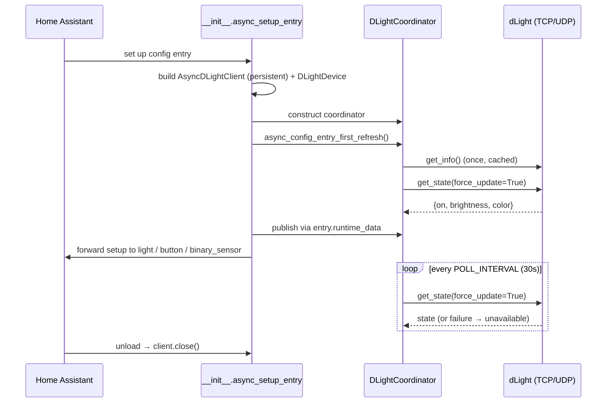

# Architecture Overview

The integration follows Home Assistant's modern **coordinator + entity** pattern, with a single composition root and a strict rule: **`__init__.py` builds everything; platforms only consume.**

## Design principles

- **One config entry per physical lamp**, unique ID `dlight_<device_id>`.
- **Local only.** UDP discovery + persistent TCP commands via [`dlight-client`](https://pypi.org/project/dlight-client/). No cloud.
- **Single owner of I/O.** One `DLightCoordinator` per lamp owns the device handle, polling, and a command lock. Entities never talk to the lamp directly except through it.
- **Config-flow only.** No YAML, no options flow (the poll interval is fixed by design — [ADR-0010](#design-decisions)).
- **Optimistic UX, authoritative polling.** The UI reacts instantly; periodic polls reconcile against device truth.

## Module map

| Module (`custom_components/dlight/`) | Responsibility |
|---|---|
| `__init__.py` | **Composition root.** Builds the `DLightDevice` with a persistent `AsyncDLightClient` and the `DLightCoordinator`, primes the first refresh, publishes the coordinator via `entry.runtime_data`, and registers `client.close` on unload. |
| `coordinator.py` | `DLightCoordinator`: fetches static device info **once**, then polls `get_state(force_update=True)` every interval. Owns `command_lock`. Drives runtime IP rediscovery after repeated failures. |
| `light.py` | `DLightEntity`: optimistic light view, emulated transitions, command serialization. |
| `button.py` | Identify button (flashes the lamp). |
| `binary_sensor.py` | Connectivity diagnostic sensor mirroring poll health. |
| `config_flow.py` | Discovery, manual entry, reconfigure, and DHCP self-healing. |
| `diagnostics.py` | Redacted entry/coordinator snapshot. |
| `const.py` | Domain, config keys, Kelvin range, poll interval/timeout, rediscovery backoff. |
| `translations/` | `en`, `de`, `fr`, `ja`, `ga` — kept at parity with `strings.json`. |

## Lifecycle

## Data flow & concurrency

- **One TCP socket per lamp.** Because the lamp speaks over a single persistent connection, commands must not interleave. The coordinator's **`command_lock`** (an `asyncio.Lock`) serializes every device command across platforms — light commands, transition fade steps, and the identify flash.
- **`PARALLEL_UPDATES = 1`** on the light and button platforms serializes service calls *within* a platform; `command_lock` covers serialization *across* platforms. Both are needed.
- **Two payloads, two cadences:** `get_info` (static identity) is fetched once and cached for the device-registry card; `get_state` is the per-interval poll target.

## Two state models

The integration deliberately maintains two views of a lamp:

1. **Authoritative** — what the coordinator last *confirmed* by polling.
2. **Optimistic** — what the entity *asked for* and assumes succeeded, held briefly so the UI feels instant.

A confirmed poll reconciles (2) against (1), with guards so a stale poll can't undo a rapid-fire interaction. This is the heart of [Light Entity & Optimistic State](light-entity.md).

## Resilience

- **Availability:** any failed poll marks the light unavailable; the connectivity sensor reports it without itself going unavailable.
- **IP self-healing:** three independent paths recover a lamp that changed address — the DHCP watcher, a runtime rediscovery sweep, and re-running setup. See [Config Flow & IP Self-Healing](config-flow.md).

## Design decisions

Architectural decisions are recorded as ADRs in the repository (e.g. **ADR-0010** removed the options flow and fixed the poll interval). When a change alters a documented decision, update or add an ADR alongside the code.

## Dive deeper

- [Coordinator & Polling](coordinator.md)
- [Light Entity & Optimistic State](light-entity.md)
- [Config Flow & IP Self-Healing](config-flow.md)
