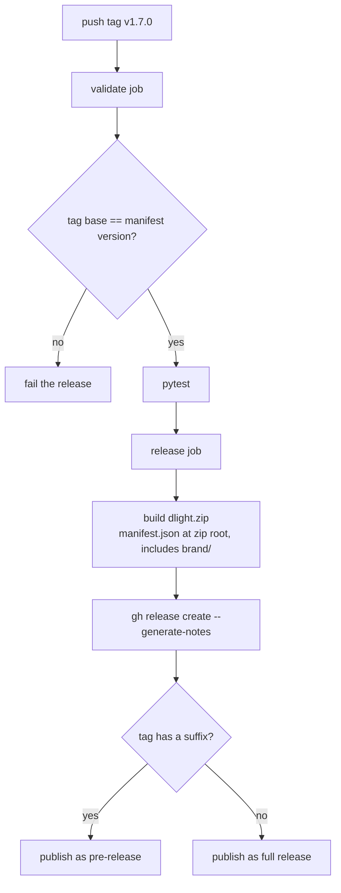

# Releasing

Releases are **automated** by a GitHub Actions workflow. A maintainer bumps the version, commits, and pushes a tag — the workflow validates, tests, builds, and publishes.

## Versioning

The project uses [semantic versioning](https://semver.org/): `vMAJOR.MINOR.PATCH`. A tag with a suffix (e.g. `v1.7.0-rc1`) is published as a **pre-release**.

The single source of truth for the version is `version` in `custom_components/dlight/manifest.json`. **The tag must match it** — the release workflow fails otherwise.

## Cutting a release

1. **Bump the version** in `custom_components/dlight/manifest.json`:
   ```json
   { "version": "1.7.0" }
   ```
2. **Commit** the bump:
   ```bash
   git commit -am "release: v1.7.0 — <one-line summary>"
   ```
3. **Push** the commit, then **push a matching tag**:
   ```bash
   git push
   git push origin v1.7.0     # tag base must equal manifest version
   ```

That's it — the rest is automated.

## What the Release workflow does

Triggered by pushing a `v*` tag (`.github/workflows/release.yaml`):



1. **Validate** — checks the tag base (`v1.7.0-rc1` → `1.7.0`) equals the manifest version, then runs `pytest`.
2. **Build** — zips `custom_components/dlight/` into `dlight.zip` with `manifest.json` at the **zip root** (the HACS `zip_release` convention), **including `brand/`**, and excluding `__pycache__`.
3. **Publish** — creates the GitHub release with auto-generated notes; suffixed tags become pre-releases.

## Why the zip must include `brand/`

HACS installs the `dlight.zip` asset (`hacs.json` sets `zip_release: true` and `filename: dlight.zip`). From Home Assistant **2026.3+**, the integration's brand icon is served locally from `custom_components/dlight/brand/` via the brands proxy — so the icon displays without a `home-assistant/brands` submission. If `brand/` is missing from the zip, the icon won't render. **Every release must carry the zip, and the zip must include `brand/`.**

## Checklist before tagging

- [ ] `manifest.json` version bumped.
- [ ] `pytest` passes locally.
- [ ] New UI strings mirrored across all [translations](localization.md).
- [ ] Docs updated for any user-facing change.
- [ ] `brand/` is intact and unmoved.
- [ ] Commit pushed **before** the tag, and the tag base matches the manifest.

## If a release fails

- **Tag/manifest mismatch:** delete the tag (`git push --delete origin v1.7.0`), fix `manifest.json`, recommit, and re-tag.
- **Tests fail in CI:** fix on `main`, then cut a new patch version — don't reuse a tag.
