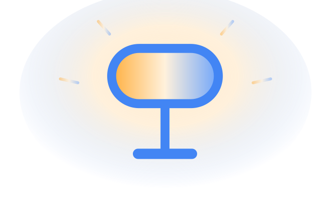

---
hide:
  - navigation
---

{ .dlight-logo }
{ .dlight-logo }

Local control for dLight smart lamps in Home Assistant — no cloud, low latency.

{ align=right width=260 loading=lazy }

**dLight** is a custom [Home Assistant](https://www.home-assistant.io/) integration that controls dLight smart lamps **entirely on your local network**. It talks to each lamp over UDP discovery and a persistent TCP connection through the [`dlight-client`](https://pypi.org/project/dlight-client/) library — there is no cloud account, no polling of a vendor API, and no internet dependency once the lamp is on your Wi-Fi.

## Why this integration

-   :material-lan-connect:{ .lg .middle } __Purely local__

    ---

    UDP discovery and persistent TCP commands. Lower latency, no cloud outage can take your lights down.

-   :material-lightbulb-on-outline:{ .lg .middle } __Full lamp control__

    ---

    On/off, brightness (0–100 %), and tunable white from **2600 K to 6000 K** — warm to cool.

-   :material-flash:{ .lg .middle } __Feels instant__

    ---

    Optimistic state updates the UI the moment you act; a confirmed poll reconciles it seconds later.

-   :material-ip-network-outline:{ .lg .middle } __IP self-healing__

    ---

    When DHCP hands a lamp a new address, the integration finds it again — via the DHCP watcher, a discovery sweep, or re-running setup.

## Quick start

1. **Install** via [HACS](getting-started/installation.md#hacs-recommended) (recommended) or [manually](getting-started/installation.md#manual).
2. **Restart** Home Assistant.
3. **Add the integration** — Settings → Devices & Services → **+ Add Integration** → search *dLight*. Discovery runs automatically; if it finds nothing (common in containerized HA setups), you add the lamp by **IP address + Device ID**. See [Configuration](getting-started/configuration.md).

!!! tip "Provisioning first"
    A dLight must already be on your Wi-Fi before Home Assistant can see it. Do the initial Wi-Fi setup in the Google Home app (or equivalent), then add it here.

## Where to go next

| If you want to… | Read |
|---|---|
| Get it installed and discovered | [Installation](getting-started/installation.md) · [Configuration](getting-started/configuration.md) |
| Understand what the entities do | [Features](user-guide/features.md) · [Transitions](user-guide/transitions.md) |
| Fix a lamp that won't connect | [Troubleshooting](user-guide/troubleshooting.md) |
| Understand how it works internally | [Architecture overview](architecture/overview.md) |
| Contribute code or translations | [Development setup](contributing/development.md) |

!!! warning "Unofficial integration"
    This is a community project with no official vendor support. Use at your own risk.
