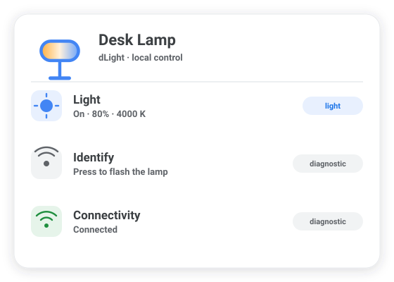
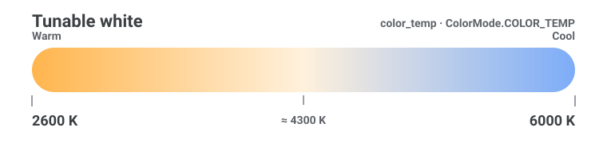

# Features

Each dLight lamp shows up as one Home Assistant **device** with a light entity and two diagnostic entities.

{ width=520 loading=lazy }

## Light entity

The primary entity. It uses Home Assistant's **color-temperature** color mode and supports:

| Capability | Range | Notes |
|---|---|---|
| **On / off** | — | Standard light toggle. |
| **Brightness** | 0–100 % (device) ↔ 0–255 (HA) | Scaled with a ceiling so 1 % never rounds to "off". |
| **Color temperature** | **2600 K – 6000 K** | Warm white to cool white (tunable white). |
| **Transition** | any duration | *Emulated* — see [Transitions](transitions.md). |

{ loading=lazy }

### Optimistic state

When you send a command, the entity updates **immediately** to what you asked for, rather than waiting up to a full poll interval for the lamp to confirm. The next confirmed poll replaces that optimistic guess with the lamp's reported truth.

A **rapid-fire guard** protects optimistic state for one poll interval after each command, so quickly dragging a brightness slider doesn't make the UI "snap back" to a stale polled value mid-interaction. The deeper mechanics are in [Light Entity & Optimistic State](../architecture/light-entity.md).

### Error feedback

If a command fails (the lamp is unreachable or rejects it), the service call raises a translatable error so Home Assistant surfaces a clear message in the UI — e.g. *"Failed to turn on Desk Lamp. Device reported: …"* — instead of failing silently.

## Identify button

A diagnostic **button** with the `identify` device class. Pressing it runs the lamp's flash sequence: the lamp saves its current state, blinks a few times, and restores itself. Handy when you have several lamps and need to tell which entry maps to which physical device.

The flash holds the device's command lock for the whole sequence, so nothing else can talk to the lamp mid-blink and corrupt the state it restores.

## Connectivity sensor

A diagnostic **binary sensor** (`connectivity` device class) that mirrors the coordinator's poll health:

- **Connected** — the last poll reached the lamp.
- **Disconnected** — the last poll failed.

Unlike the light entity (which goes *unavailable* when polls fail), this sensor **stays available** and reports *disconnected*. That makes it a reliable trigger for automations — notify yourself, retry, or power-cycle a smart plug when a lamp drops off the network.

```yaml title="Example: notify when a lamp goes offline"
automation:
  - alias: "dLight offline alert"
    trigger:
      - platform: state
        entity_id: binary_sensor.desk_lamp_connectivity
        to: "off"
        for: "00:02:00"
    action:
      - service: notify.mobile_app
        data:
          message: "Desk Lamp has been unreachable for 2 minutes."
```

## Physical control detection

When you (or another app) physically interact with a dLight lamp, the coordinator detects the change on the next poll and fires a `dlight_physical_control` event on the HA event bus. Each lamp also exposes a **Physical control** entity (`event` platform, diagnostic category) that updates in the UI for every detected physical interaction.

See [Physical Control Event](physical-control-event.md) for the full payload reference and automation examples.

## State polling

The coordinator polls each lamp every **30 seconds** (`force_update=True`, bypassing the client's local cache) to keep Home Assistant in sync with changes made outside HA — e.g. via the physical control or another app. A failed poll marks the light **unavailable** and is reflected by the connectivity sensor. See [Coordinator & Polling](../architecture/coordinator.md).

## Diagnostics export

Each device offers a redacted **diagnostics** download for bug reports — IP address and device ID are scrubbed automatically. See [Diagnostics & Bug Reports](diagnostics.md).

## Having trouble?

See the [Troubleshooting guide](troubleshooting.md) for help with discovery failures, unavailable lights, stale state, and filing bug reports.
